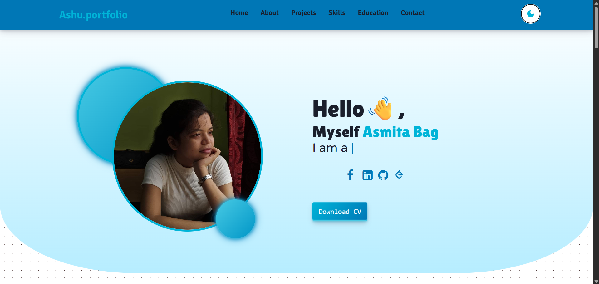

# 🚀 My Personal Portfolio Website

This is my personal portfolio website, where my skills, projects, and education are all placed. The site is coded using HTML, CSS, and JavaScript, with a lot of interactivity: animation, dark mode toggle, responsive navigation.

## 🔥 Features

- Modern UI/UX with smooth animations
- Responsive Design for all devices
- Theme Toggle (Light/Dark Mode)
- Projects Showcase with details and GitHub links
- Skills & Education Sections
- Contact Form for direct communication (but it is static for now!!)
- Social Media Links (LinkedIn, GitHub, LeetCode, etc.)

## 🛠️ Technologies Used
- Frontend: HTML, CSS, JavaScript
- Libraries: Typed.js, ScrollReveal.js, FontAwesome

## 🤖 Live Demo
https://bagashu2525.github.io/My_Portfolio/

## 📸 Screenshots

## 📂 Setup & Installation
1. Clone the repository:

git clone https://github.com/bagashu2525/portfolio.git

2. Open index.html in a browser

## 📬 Connect with Me
- 📧 Email: bagasmita25@gmail.com
- 🔗 LinkedIn: Asmita Bag
- 🐙 GitHub: @bagashu2525
